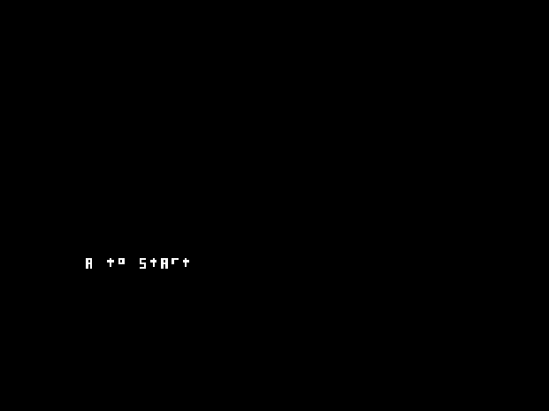
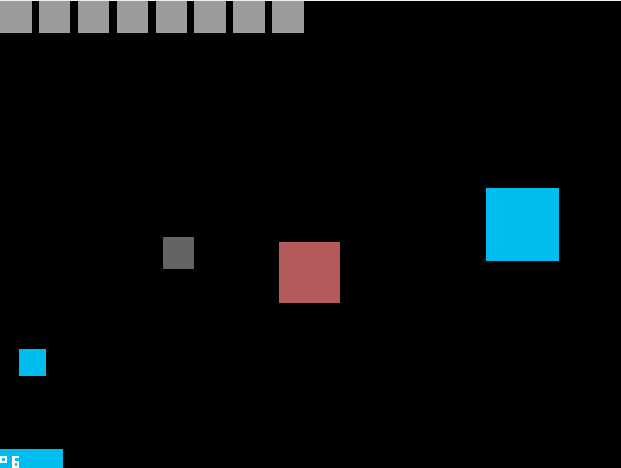

# Flying Saturn

A NDS game by Jonas Trebicki

### Introduction

After watching a youtube video (see additional ressources), I was inspired to program a game for the DS. With a simple graphics library that is able to draw squares I made a little arcade game.

### Dependencies/Deployment

You will need to install devkitPro: https://devkitpro.org/wiki/Getting_Started

You will also have to install the libgl2d Library. http://rel.phatcode.net/junk.php?id=117 or https://github.com/DeathCamel57/libgl2d_ds

A text snippet of the libgl2d Installation:

> Installation:
>
> 1 . Copy the distributable/libnds folder to your devkitPro directory. or you can copy the /include and /lib folders under the /libnds directory of devkitPro. ie. *Assuming you installed devkitPro in c:/devkitPro/
>
> ```
> c:/devkitPro/libnds/include/gl2d.h   
> c:/devkitPro/libnds/lib/libgl2d.a
> ```

#### Specifics

###### Windows

Just use the graphic installer (https://github.com/devkitPro/installer/releases) then 

> -  Windows 7 and earlier: Start -> All Programs -> devkitPro -> MSYS
> -  Windows 8 and 8.1: Right click on the Start screen and select 'All Apps'. You should find MSYS there.
> -  Windows 10 (pre-Anniversary Update): Start -> All Apps -> devkitPro -> MSYS
> -  Windows 10 (post-Anniversary Update): Start -> devkitPro -> MSYS

(snippet from https://devkitpro.org/wiki/Getting_Started)

##### MACOS and UNIX-like plattforms

I did not personally try this, so try at your own risk!

###### MacOS

Snippet from https://devkitpro.org/wiki/Getting_Started

> -  To get the Xcode command line tools run `xcode-select --install` from Terminal.
> -  Use the [pkg installer](https://github.com/devkitPro/pacman/releases/latest) to install [devkitPro pacman](https://devkitpro.org/wiki/devkitPro_pacman).
> -  Reboot your mac to get environment set.
> -  Use dkp-pacman to install your chosen tools as per Unix like platforms below.

###### Unix-like plattforms

Follow instructions: https://devkitpro.org/wiki/devkitPro_pacman

###### Using dkp-pacman

You will need the nds-dev package

>  **sudo (dkp-)pacman -S nds-dev**

### How to build

Use `make` in the projects root folder to use the provided Makefile.

### How to play the game

#### How to start

1. Emulator

   Just get an Emulator like DesMuMe or No$GBA and load the ROM.

2. Actual Hardware

   You will need a working flashcard (I used an R4) and some kind of homebrew menu, like [hbmenu](https://github.com/devkitPro/nds-hb-menu)  (thats from the devKitPro Team) or YSMenu

   Simply drag and drop the .NDS File onto your SD Card and run it from the menu.

#### How to play

You control the red square. You have to press A or B repeatedly to fly up. If you fall out of the screen, you lose a life. With the touchscreen, by swiping left and right, you can control a grey projectile; if you manage to hit the blue squares flying around you, you destroy them and gain score. The blue squares fly though the screen, if they hit you, you also lose a life.

### Images






### Additional Interesting Ressources

DsBuff: To change ROM information (Name, Icon) to be seen in the homebrew launcher https://www.romhacking.net/utilities/1214/

PolyMars' video that inspired me for this project: https://www.youtube.com/watch?v=h7pq9hUMnog


#### Licenses of devkitPro and Libgl2d

libgl2d:

> This sofware is provided with the "use or abuse" license. Anyone is permitted to
> copy it, distribute it, reverse engineer it, or make money out of it.
>
> The author can never be held liable for any damages arising from the use of this sofware.
>
> Richard Eric M. Lope
> http://rel.phatcode.net

devkitPro: (https://devkitpro.org/wiki/Trademarks): 

GNU General Public License
